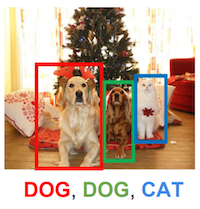
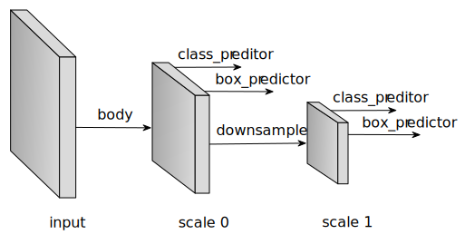
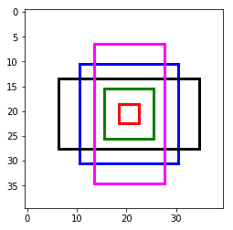
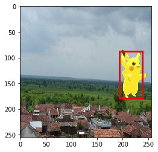
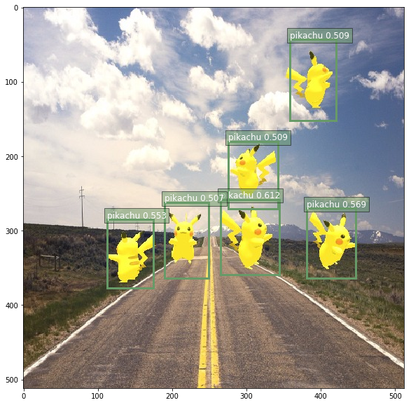

# 卷积神经网络目标检测上手教程

目标检测通俗的来说是为了找到图像或者视频里的所有目标物体。在下面这张图中，两狗一猫的位置，包括它们所属的类（狗／猫），需要被正确的检测到。




所以和图像分类不同的地方在于，目标检测需要找到尽量多的目标物体，而且要准确的定位物体的位置，一般用矩形框来表示。


在接下来的章节里，我们先介绍一个流行的目标检测算法，SSD (Single-Shot MultiBox Object Detection).


## SSD:  Single Shot MultiBox Detector

顾名思义，算法的核心是用卷积神经网络一次前向推导求出大量多尺度（几百到几千）的方框来表示目标检测的结果。网络的结构用下图表示。




跟所有的图像相关的网络一样，我们需要一个`主干网络`来提取特征，同时也是作为第一个预测特征层。网络在当前层产生大量的`预设框`，和与之对应的每个方框的`分类概率`（背景，猫，狗。。。）以及真正的物体和预设框的`偏移量`。在完成当前层的预测后，我们会下采样当前特征层，作为新的预测层，重新产生新的`预设框`，`分类概率`，`偏移量`。这个过程往往会重复好几次，直到预测特征层到达全局尺度（$1 \times 1$)。

接下来我们用例子解释每个细节实现。

### 预设框 Default anchor boxes

预设框的形状和大小可以由参数控制，我们往往设置一堆预设框，以期望任意图像上的物体都能有一个预设框能大致重合，由于每个预设框需要对应的预测网络预测值，所以希望对于每个物体都有100%重合的预设框是不现实的，可能会需要几十万甚至几百万的预设框，但是采样的预设框越多，重合概率越好，用几千到上万个预设框基本能实现略大于70%的最好重合率，同时保证了检测的速度。

为了保证重合覆盖率，对于每个特征层上的像素点，我们用不同的大小和长宽比来采样预设框。 假设在某个特定的特征层（$w \times h$），每个预设框的中心点就是特征像素点的中心，然后我们用如下的公式采样预设框的大小：
- 对于长宽比 $r = 1$, size $s\in (0,1]$, 生成的预设框大小 $ws \times hs$
- 对于长宽比 $r > 0$ 同时 $r \neq 1$, 生成的预设框大小 $ws\sqrt{r} \times \frac{hs}{\sqrt{r}}$


这里例子里，我们用事先实现的层`MultiBoxPrior`产生预设框，输入*n*个预设尺寸，和*m*个预设的长宽比，输出为*n+m-1*个方框（`sizes[i], ratios[0]` if $i \le n$ otherwise `sizes[0], ratios[i-n]`)而不是n*m个。 当然我们完全可以使用其他的算法产生不同的预设框，但是实践中我们发现上述的方法覆盖率和相应需要的预设框数量比较合适。


```python
import mxnet as mx
from mxnet import nd
from mxnet.contrib.ndarray import MultiBoxPrior

n = 40
# 输入形状: batch x channel x height x weight
x = nd.random_uniform(shape=(1, 3, n, n))  

y = MultiBoxPrior(x, sizes=[.5, .25, .1], ratios=[1, 2, .5])

# 取位于 (20,20) 像素点的第一个预设框
# 格式为 (x_min, y_min, x_max, y_max)
boxes = y.reshape((n, n, -1, 4))
print('The first anchor box at row 21, column 21:', boxes[20, 20, 0, :])
```

    The first anchor box at row 21, column 21:
    [ 0.26249999  0.26249999  0.76249999  0.76249999]
    <NDArray 4 @cpu(0)>

看着数字不够直观的话，我们把框框画出来。取最中心像素的所有预设框，画在图上的话，我们看到已经可以覆盖几种尺寸和位置的物体了。把所有位置的组合起来，就是相当可观的预设框集合了。


```python
import matplotlib.pyplot as plt
def box_to_rect(box, color, linewidth=3):
    """convert an anchor box to a matplotlib rectangle"""
    box = box.asnumpy()
    return plt.Rectangle(
        (box[0], box[1]), (box[2]-box[0]), (box[3]-box[1]),
        fill=False, edgecolor=color, linewidth=linewidth)
colors = ['blue', 'green', 'red', 'black', 'magenta']
plt.imshow(nd.ones((n, n, 3)).asnumpy())
anchors = boxes[20, 20, :, :]
for i in range(anchors.shape[0]):
    plt.gca().add_patch(box_to_rect(anchors[i,:]*n, colors[i]))
plt.show()
```





### 分类预测 Predict classes

这个部分的目标很简单，就是预测每个预设框对应的分类。我们用$3 \times 3$， Padding (填充) $1 \times 1$的卷积来预测分类概率，这样可以做到卷积后空间上的形状不会变化，而且由于卷积的特点，每个卷积核会扫过每个预测特征层的所有像素点，得到$C \times H \times W$个预测值，$H \times W$对应了空间上所有的像素点，每个通道对应特定的预设框。$C = (类别 + 1) \times 预设框数量$。假设有10个正类，每个像素5个预设框，那么我们就需要$11 \times 5 = 55$个通道。 具体的来说，对于每个像素第*i*个预设框：
- 通道 `i * (类别 + 1)` 的值对应背景（非物体）的得分
- 通道 `i * (类别 + 1) + 1 + j` 对应了第j类的得分


```python
from mxnet.gluon import nn
def class_predictor(num_anchors, num_classes):
    """return a layer to predict classes"""
    return nn.Conv2D(num_anchors * (num_classes + 1), 3, padding=1)

cls_pred = class_predictor(5, 10)
cls_pred.initialize()
x = nd.zeros((2, 3, 20, 20))
print('Class prediction', cls_pred(x).shape)
```

    Class prediction (2, 55, 20, 20)


### 预测预设框偏移 Predict anchor boxes

为了找到物体准确的位置，光靠预设框本身是不行的，我们还需要预测偏移量以便把真正的物体框出来。
假设 $b$ 是某个预设框， $Y$ 是目标物体的真实矩形框，我们需要预测的偏移为 $\Delta(Y, b) = (t_x, t_y, t_{width}, t_{height})$，全都是长度为4的向量， 我们求得偏移
- $t_x = (Y_x - b_x) / b_{width}$
- $t_y = (Y_y - b_y) / b_{height}$
- $t_{width} = (Y_{width} - b_{width}) / b_{width}$
- $t_{height} = (Y_{height} - b_{height}) / b_{height}$

所有的偏移量都除以预设框的长或宽是为了更好的收敛。

类似分类概率，我们同样用$3 \times 3$填充$1 \times 1$的卷积来预测偏移。这次不同的是，对于每个预设框，我们只需要4个通道来预测偏移量， 一共需要`预设框数量 * 4`个通道，第 *i* 个预设框对应的偏移量存在通道 `i*4` 到通道 `i*4+3` 之间。


```python
def box_predictor(num_anchors):
    """return a layer to predict delta locations"""
    return nn.Conv2D(num_anchors * 4, 3, padding=1)

box_pred = box_predictor(10)
box_pred.initialize()
x = nd.zeros((2, 3, 20, 20))
print('Box prediction', box_pred(x).shape)
```

    Box prediction (2, 40, 20, 20)


### 下采样特征层 Down-sample features

每次我们下采样特征层到一半的长宽，用Pooling(池化)操作就可以轻松的做到，当然也可以用stride(步长)为2的卷积直接得到。在下采样之前，我们会希望增加几层卷积层作为缓冲，防止特征值对应多尺度带来的混乱，同时又能增加网络的深度，得到更好的抽象。


```python
def down_sample(num_filters):
    """stack two Conv-BatchNorm-Relu blocks and then a pooling layer
    to halve the feature size"""
    out = nn.HybridSequential()
    for _ in range(2):
        out.add(nn.Conv2D(num_filters, 3, strides=1, padding=1))
        out.add(nn.BatchNorm(in_channels=num_filters))
        out.add(nn.Activation('relu'))
    out.add(nn.MaxPool2D(2))
    return out

blk = down_sample(10)
blk.initialize()
x = nd.zeros((2, 3, 20, 20))
print('Before', x.shape, 'after', blk(x).shape)
```

    Before (2, 3, 20, 20) after (2, 10, 10, 10)


### 整合多个特征层预测值 Manage predictions from multiple layers

SSD算法的一个关键点在于它用到了多尺度的特征层来预测不同大小的物体。相对来说，浅层的特征层的空间尺度更大，越到网络的深层，空间尺度越小，最后我们往往下采样直到$1 \times 1$，用来预测全图大小的物体。所以每个特征层产生的`预设框`， `分类概率`, `框偏移量` 需要被整合起来统一在全图与真实的物体比较。 为了做到一一对应，我们统一把所有的`预设框`， `分类概率`, `框偏移量` 平铺再连接。得到的是按顺序排列但是摊平的所有预测值和预设框。


```python
# 随便创建一个大小为 20x20的预测层
feat1 = nd.zeros((2, 8, 20, 20))
print('Feature map 1', feat1.shape)
cls_pred1 = class_predictor(5, 10)
cls_pred1.initialize()
y1 = cls_pred1(feat1)
print('Class prediction for feature map 1', y1.shape)
# 下采样
ds = down_sample(16)
ds.initialize()
feat2 = ds(feat1)
print('Feature map 2', feat2.shape)
cls_pred2 = class_predictor(3, 10)
cls_pred2.initialize()
y2 = cls_pred2(feat2)
print('Class prediction for feature map 2', y2.shape)
```

    Feature map 1 (2, 8, 20, 20)
    Class prediction for feature map 1 (2, 55, 20, 20)
    Feature map 2 (2, 16, 10, 10)
    Class prediction for feature map 2 (2, 33, 10, 10)


```python
def flatten_prediction(pred):
    return nd.flatten(nd.transpose(pred, axes=(0, 2, 3, 1)))

def concat_predictions(preds):
    return nd.concat(*preds, dim=1)

flat_y1 = flatten_prediction(y1)
print('Flatten class prediction 1', flat_y1.shape)
flat_y2 = flatten_prediction(y2)
print('Flatten class prediction 2', flat_y2.shape)
print('Concat class predictions', concat_predictions([flat_y1, flat_y2]).shape)
```

    Flatten class prediction 1 (2, 22000)
    Flatten class prediction 2 (2, 3300)
    Concat class predictions (2, 25300)


### 主干网络 Body network

主干网络用来从原始图像输入提取特征。 一般来说我们会用预先训练好的用于分类的高性能网络
（VGG, ResNet等）来提取特征。
在这里我们就简单地堆叠几层卷积和下采样层作为主干网络来示例。


```python
from mxnet import gluon
def body():
    """return the body network"""
    out = nn.HybridSequential()
    for nfilters in [16, 32, 64]:
        out.add(down_sample(nfilters))
    return out

bnet = body()
bnet.initialize()
x = nd.zeros((2, 3, 256, 256))
print('Body network', [y.shape for y in bnet(x)])
```

    Body network [(64, 32, 32), (64, 32, 32)]


### 设计一个简单的SSD示意网络 Create a toy SSD model

我们这里介绍一个示意用的简单SSD网络，出于速度的考量，输入图像尺寸定为 $256 \times 256$。


```python
def toy_ssd_model(num_anchors, num_classes):
    """return SSD modules"""
    downsamples = nn.Sequential()
    class_preds = nn.Sequential()
    box_preds = nn.Sequential()

    downsamples.add(down_sample(128))
    downsamples.add(down_sample(128))
    downsamples.add(down_sample(128))

    for scale in range(5):
        class_preds.add(class_predictor(num_anchors, num_classes))
        box_preds.add(box_predictor(num_anchors))

    return body(), downsamples, class_preds, box_preds

print(toy_ssd_model(5, 2))
```

    (HybridSequential(
      (0): HybridSequential(
        (0): Conv2D(16, kernel_size=(3, 3), stride=(1, 1), padding=(1, 1))
        (1): BatchNorm(fix_gamma=False, axis=1, momentum=0.9, eps=1e-05, in_channels=16)
        (2): Activation(relu)
        (3): Conv2D(16, kernel_size=(3, 3), stride=(1, 1), padding=(1, 1))
        (4): BatchNorm(fix_gamma=False, axis=1, momentum=0.9, eps=1e-05, in_channels=16)
        (5): Activation(relu)
        (6): MaxPool2D(size=(2, 2), stride=(2, 2), padding=(0, 0), ceil_mode=False)
      )
      (1): HybridSequential(
        (0): Conv2D(32, kernel_size=(3, 3), stride=(1, 1), padding=(1, 1))
        (1): BatchNorm(fix_gamma=False, axis=1, momentum=0.9, eps=1e-05, in_channels=32)
        (2): Activation(relu)
        (3): Conv2D(32, kernel_size=(3, 3), stride=(1, 1), padding=(1, 1))
        (4): BatchNorm(fix_gamma=False, axis=1, momentum=0.9, eps=1e-05, in_channels=32)
        (5): Activation(relu)
        (6): MaxPool2D(size=(2, 2), stride=(2, 2), padding=(0, 0), ceil_mode=False)
      )
      (2): HybridSequential(
        (0): Conv2D(64, kernel_size=(3, 3), stride=(1, 1), padding=(1, 1))
        (1): BatchNorm(fix_gamma=False, axis=1, momentum=0.9, eps=1e-05, in_channels=64)
        (2): Activation(relu)
        (3): Conv2D(64, kernel_size=(3, 3), stride=(1, 1), padding=(1, 1))
        (4): BatchNorm(fix_gamma=False, axis=1, momentum=0.9, eps=1e-05, in_channels=64)
        (5): Activation(relu)
        (6): MaxPool2D(size=(2, 2), stride=(2, 2), padding=(0, 0), ceil_mode=False)
      )
    ), Sequential(
      (0): HybridSequential(
        (0): Conv2D(128, kernel_size=(3, 3), stride=(1, 1), padding=(1, 1))
        (1): BatchNorm(fix_gamma=False, axis=1, momentum=0.9, eps=1e-05, in_channels=128)
        (2): Activation(relu)
        (3): Conv2D(128, kernel_size=(3, 3), stride=(1, 1), padding=(1, 1))
        (4): BatchNorm(fix_gamma=False, axis=1, momentum=0.9, eps=1e-05, in_channels=128)
        (5): Activation(relu)
        (6): MaxPool2D(size=(2, 2), stride=(2, 2), padding=(0, 0), ceil_mode=False)
      )
      (1): HybridSequential(
        (0): Conv2D(128, kernel_size=(3, 3), stride=(1, 1), padding=(1, 1))
        (1): BatchNorm(fix_gamma=False, axis=1, momentum=0.9, eps=1e-05, in_channels=128)
        (2): Activation(relu)
        (3): Conv2D(128, kernel_size=(3, 3), stride=(1, 1), padding=(1, 1))
        (4): BatchNorm(fix_gamma=False, axis=1, momentum=0.9, eps=1e-05, in_channels=128)
        (5): Activation(relu)
        (6): MaxPool2D(size=(2, 2), stride=(2, 2), padding=(0, 0), ceil_mode=False)
      )
      (2): HybridSequential(
        (0): Conv2D(128, kernel_size=(3, 3), stride=(1, 1), padding=(1, 1))
        (1): BatchNorm(fix_gamma=False, axis=1, momentum=0.9, eps=1e-05, in_channels=128)
        (2): Activation(relu)
        (3): Conv2D(128, kernel_size=(3, 3), stride=(1, 1), padding=(1, 1))
        (4): BatchNorm(fix_gamma=False, axis=1, momentum=0.9, eps=1e-05, in_channels=128)
        (5): Activation(relu)
        (6): MaxPool2D(size=(2, 2), stride=(2, 2), padding=(0, 0), ceil_mode=False)
      )
    ), Sequential(
      (0): Conv2D(15, kernel_size=(3, 3), stride=(1, 1), padding=(1, 1))
      (1): Conv2D(15, kernel_size=(3, 3), stride=(1, 1), padding=(1, 1))
      (2): Conv2D(15, kernel_size=(3, 3), stride=(1, 1), padding=(1, 1))
      (3): Conv2D(15, kernel_size=(3, 3), stride=(1, 1), padding=(1, 1))
      (4): Conv2D(15, kernel_size=(3, 3), stride=(1, 1), padding=(1, 1))
    ), Sequential(
      (0): Conv2D(20, kernel_size=(3, 3), stride=(1, 1), padding=(1, 1))
      (1): Conv2D(20, kernel_size=(3, 3), stride=(1, 1), padding=(1, 1))
      (2): Conv2D(20, kernel_size=(3, 3), stride=(1, 1), padding=(1, 1))
      (3): Conv2D(20, kernel_size=(3, 3), stride=(1, 1), padding=(1, 1))
      (4): Conv2D(20, kernel_size=(3, 3), stride=(1, 1), padding=(1, 1))
    ))


### 网络前向推导 Forward

既然我们已经设计完网络结构了，接下来可以定义网络前向推导的步骤。
首先得到主干网络的输出，然后对于每一个特征预测层，推导当前层的预设框，分类概率和偏移量。
最后我们把这些输入摊平，连接，作为网络的输出。


```python
def toy_ssd_forward(x, body, downsamples, class_preds, box_preds, sizes, ratios):                
    # 计算主干网络的输出        
    x = body(x)

    # 在每个预测层, 计算预设框，分类概率，偏移量
    # 然后在下采样到下一层预测层，重复
    default_anchors = []
    predicted_boxes = []  
    predicted_classes = []

    for i in range(5):
        default_anchors.append(MultiBoxPrior(x, sizes=sizes[i], ratios=ratios[i]))
        predicted_boxes.append(flatten_prediction(box_preds[i](x)))
        predicted_classes.append(flatten_prediction(class_preds[i](x)))
        if i < 3:
            x = downsamples[i](x)
        elif i == 3:
            # 最后一层可以简单地用全局Pooling
            x = nd.Pooling(x, global_pool=True, pool_type='max', kernel=(4, 4))

    return default_anchors, predicted_classes, predicted_boxes
```

### 成果 Put all things together

```python
from mxnet import gluon
class ToySSD(gluon.Block):
    def __init__(self, num_classes, **kwargs):
        super(ToySSD, self).__init__(**kwargs)
        # 5个预测层，每层负责的预设框尺寸不同，由小到大，符合网络的形状
        self.anchor_sizes = [[.2, .272], [.37, .447], [.54, .619], [.71, .79], [.88, .961]]
        # 每层的预设框都用 1，2，0.5作为长宽比候选
        self.anchor_ratios = [[1, 2, .5]] * 5
        self.num_classes = num_classes

        with self.name_scope():
            self.body, self.downsamples, self.class_preds, self.box_preds = toy_ssd_model(4, num_classes)

    def forward(self, x):
        default_anchors, predicted_classes, predicted_boxes = toy_ssd_forward(x, self.body, self.downsamples,
            self.class_preds, self.box_preds, self.anchor_sizes, self.anchor_ratios)
        # 把从每个预测层输入的结果摊平并连接，以确保一一对应
        anchors = concat_predictions(default_anchors)
        box_preds = concat_predictions(predicted_boxes)
        class_preds = concat_predictions(predicted_classes)
        # 改变下形状，为了更方便地计算softmax
        class_preds = nd.reshape(class_preds, shape=(0, -1, self.num_classes + 1))

        return anchors, class_preds, box_preds
```

### 网络输出示意 Outputs of ToySSD


```python
# 新建一个2个正类的SSD网络
net = ToySSD(2)
net.initialize()
x = nd.zeros((1, 3, 256, 256))
default_anchors, class_predictions, box_predictions = net(x)
print('Outputs:', 'anchors', default_anchors.shape, 'class prediction', class_predictions.shape, 'box prediction', box_predictions.shape)
```

    Outputs: anchors (1, 5444, 4) class prediction (1, 5444, 3) box prediction (1, 21776)


## 数据集 Dataset

聊了半天怎么构建一个虚无的网络，接下来看看真正有意思的东西。
我们用3D建模批量生成了一个皮卡丘的数据集，产生了1000张图片作为这个展示用的训练集。
这个数据集里面，皮神会以各种角度，各种姿势出现在各种背景图中，就像Pokemon Go里增强现实那样炫酷。
因为是生成的数据集，我们自然可以得到每只皮神的真实坐标和大小，用来作为训练的真实标记。


### 下载数据集 Download dataset

下载提前准备好的数据集并验证

```python
from mxnet.test_utils import download
import os.path as osp
def verified(file_path, sha1hash):
    import hashlib
    sha1 = hashlib.sha1()
    with open(file_path, 'rb') as f:
        while True:
            data = f.read(1048576)
            if not data:
                break
            sha1.update(data)
    matched = sha1.hexdigest() == sha1hash
    if not matched:
        print('Found hash mismatch in file {}, possibly due to incomplete download.'.format(file_path))
    return matched

url_format = 'https://apache-mxnet.s3-accelerate.amazonaws.com/gluon/datasets/pikachu/{}'
hashes = {'train.rec': 'e6bcb6ffba1ac04ff8a9b1115e650af56ee969c8',
          'train.idx': 'dcf7318b2602c06428b9988470c731621716c393',
          'val.rec': 'd6c33f799b4d058e82f2cb5bd9a976f69d72d520'}
for k, v in hashes.items():
    fname = 'pikachu_' + k
    target = osp.join('data', fname)
    url = url_format.format(k)
    if not osp.exists(target) or not verified(target, v):
        print('Downloading', target, url)
        download(url, fname=fname, dirname='data', overwrite=True)
```

### 加载数据 Load dataset

加载数据可以用`mxnet.image.ImageDetIter`，同时还提供了大量数据增强的选项，比如翻转，随机截取等等。

```python
import mxnet.image as image
data_shape = 256
batch_size = 32
def get_iterators(data_shape, batch_size):
    class_names = ['pikachu']
    num_class = len(class_names)
    train_iter = image.ImageDetIter(
        batch_size=batch_size,
        data_shape=(3, data_shape, data_shape),
        path_imgrec='./data/pikachu_train.rec',
        path_imgidx='./data/pikachu_train.idx',
        shuffle=True,
        mean=True,
        rand_crop=1,
        min_object_covered=0.95,
        max_attempts=200)
    val_iter = image.ImageDetIter(
        batch_size=batch_size,
        data_shape=(3, data_shape, data_shape),
        path_imgrec='./data/pikachu_val.rec',
        shuffle=False,
        mean=True)
    return train_iter, val_iter, class_names, num_class

train_data, test_data, class_names, num_class = get_iterators(data_shape, batch_size)
batch = train_data.next()
print(batch)
```

    DataBatch: data shapes: [(32, 3, 256, 256)] label shapes: [(32, 1, 5)]


### 示意图 Illustration

加载的训练数据还可以显示出来看看到底是怎么样的。

```python
import numpy as np

img = batch.data[0][0].asnumpy()  # 取第一批数据中的第一张，转成numpy
img = img.transpose((1, 2, 0))  # 交换下通道的顺序
img += np.array([123, 117, 104])
img = img.astype(np.uint8)  # 图片应该用0-255的范围
# 在图上画出真实标签的方框
for label in batch.label[0][0].asnumpy():
    if label[0] < 0:
        break
    print(label)
    xmin, ymin, xmax, ymax = [int(x * data_shape) for x in label[1:5]]
    rect = plt.Rectangle((xmin, ymin), xmax - xmin, ymax - ymin, fill=False, edgecolor=(1, 0, 0), linewidth=3)
    plt.gca().add_patch(rect)
plt.imshow(img)
plt.show()
```

    [ 0.          0.75724518  0.34316057  0.93332517  0.70017999]





## 训练 Train

### 损失函数 Losses

通过定义损失函数，我们可以让网络收敛到我们希望得到的目标检测功能，也就是说，我们希望网络能正确预测物体的类别，
同时能预测出准确的预设框偏移量，以正确地显示物体的真正大小和位置。
这个预测的类别和偏移量都是可以通过真实标签和网络的当前预测值得到，在这里我们用`MultiBoxTarget`层来计算，
其中包含了预测框和真实标签的匹配，正类和负类的选择，就不一一详述了。（详情见论文 SSD: Single Shot MultiBox Detector）。


```python
from mxnet.contrib.ndarray import MultiBoxTarget
def training_targets(default_anchors, class_predicts, labels):
    class_predicts = nd.transpose(class_predicts, axes=(0, 2, 1))
    z = MultiBoxTarget(*[default_anchors, labels, class_predicts])
    box_target = z[0]  # 预设框偏移量 (x, y, width, height)
    box_mask = z[1]  # box_mask用来把负类的偏移量置零，因为背景不需要位置！
    cls_target = z[2]  # 每个预设框应该对应的分类
    return box_target, box_mask, cls_target
```

在`gluon.loss`中有很多预设的损失函数可以选择，当然我们也可以快速地手写一些损失函数。

首先，对于物体分类的概率，平时我们往往用交叉墒，不过在目标检测中，我们有大量非平衡的负类（背景），
那么 Focal Loss会是一个很好的选择（详情见论文 Focal Loss for Dense Object Detection）。


```python
class FocalLoss(gluon.loss.Loss):
    def __init__(self, axis=-1, alpha=0.25, gamma=2, batch_axis=0, **kwargs):
        super(FocalLoss, self).__init__(None, batch_axis, **kwargs)
        self._axis = axis
        self._alpha = alpha
        self._gamma = gamma

    def hybrid_forward(self, F, output, label):
        output = F.softmax(output)
        pt = F.pick(output, label, axis=self._axis, keepdims=True)
        loss = -self._alpha * ((1 - pt) ** self._gamma) * F.log(pt)
        return F.mean(loss, axis=self._batch_axis, exclude=True)

# cls_loss = gluon.loss.SoftmaxCrossEntropyLoss()
cls_loss = FocalLoss()
print(cls_loss)
```

    FocalLoss(batch_axis=0, w=None)

接下来是一个流行的 SmoothL1 损失函数，用来惩罚不准确的预设框偏移量。


```python
class SmoothL1Loss(gluon.loss.Loss):
    def __init__(self, batch_axis=0, **kwargs):
        super(SmoothL1Loss, self).__init__(None, batch_axis, **kwargs)

    def hybrid_forward(self, F, output, label, mask):
        loss = F.smooth_l1((output - label) * mask, scalar=1.0)
        return F.mean(loss, self._batch_axis, exclude=True)

box_loss = SmoothL1Loss()
print(box_loss)
```

    SmoothL1Loss(batch_axis=0, w=None)


### 衡量性能指标 Evaluate metrics

我们在训练时需要一些指标来衡量训练是否顺利，我们这里用准确率衡量分类的性能，用平均绝对误差衡量偏移量的预测能力。
这些指标对网络本身没有任何影响，只是用于观测。


```python
cls_metric = mx.metric.Accuracy()
box_metric = mx.metric.MAE()  # measure absolute difference between prediction and target
```

### 选择训练用的设备 Set context for training

```python

ctx = mx.gpu()  # 用GPU加速训练过程
try:
    _ = nd.zeros(1, ctx=ctx)
    # 为了更有效率，cuda实现需要少量的填充，不影响结果
    train_data.reshape(label_shape=(3, 5))
    train_data = test_data.sync_label_shape(train_data)
except mx.base.MXNetError as err:
    # 没有gpu也没关系，交给cpu了
    print('No GPU enabled, fall back to CPU, sit back and be patient...')
    ctx = mx.cpu()
```

### 初始化网络参数 Initialize parameters


```python
net = ToySSD(num_class)
net.initialize(mx.init.Xavier(magnitude=2), ctx=ctx)
```

### 用gluon.Trainer简化训练过程 Set up trainer

gluon.Trainer能简化优化网络参数的过程，免去对各个参数单独更新的痛苦。

```python
net.collect_params().reset_ctx(ctx)
trainer = gluon.Trainer(net.collect_params(), 'sgd', {'learning_rate': 0.1, 'wd': 5e-4})
```

### 开始训练 Start training

既然是简单的示例，我们不想花费太多的时间来训练网络，所以会预加载训练过一段时间的网络参数继续训练。
如果你感兴趣的话，可以设置`from_scratch = True`，这样网络就会从初始的随机参数开始训练。
一般用单个gpu会花费半个多小时的时间来得到满意的结果。


```python
epochs = 150  # 设大一点的值来得到更好的结果
log_interval = 20
from_scratch = False  # 设为True就可以从头开始训练
if from_scratch:
    start_epoch = 0
else:
    start_epoch = 148
    pretrained = 'ssd_pretrained.params'
    sha1 = 'fbb7d872d76355fff1790d864c2238decdb452bc'
    url = 'https://apache-mxnet.s3-accelerate.amazonaws.com/gluon/models/ssd_pikachu-fbb7d872.params'
    if not osp.exists(pretrained) or not verified(pretrained, sha1):
        print('Downloading', pretrained, url)
        download(url, fname=pretrained, overwrite=True)
    net.load_params(pretrained, ctx)
```


```python
import time
from mxnet import autograd as ag
for epoch in range(start_epoch, epochs):
    # 重置iterator和时间戳
    train_data.reset()
    cls_metric.reset()
    box_metric.reset()
    tic = time.time()
    # 迭代每一个批次
    for i, batch in enumerate(train_data):
        btic = time.time()
        # 用autograd.record记录需要计算的梯度
        with ag.record():
            x = batch.data[0].as_in_context(ctx)
            y = batch.label[0].as_in_context(ctx)
            default_anchors, class_predictions, box_predictions = net(x)
            box_target, box_mask, cls_target = training_targets(default_anchors, class_predictions, y)
            # 损失函数计算
            loss1 = cls_loss(class_predictions, cls_target)
            loss2 = box_loss(box_predictions, box_target, box_mask)
            # 1比1叠加两个损失函数，也可以加权重
            loss = loss1 + loss2
            # 反向推导
            loss.backward()
        # 用trainer更新网络参数
        trainer.step(batch_size)
        # 更新下衡量的指标
        cls_metric.update([cls_target], [nd.transpose(class_predictions, (0, 2, 1))])
        box_metric.update([box_target], [box_predictions * box_mask])
        if (i + 1) % log_interval == 0:
            name1, val1 = cls_metric.get()
            name2, val2 = box_metric.get()
            print('[Epoch %d Batch %d] speed: %f samples/s, training: %s=%f, %s=%f'
                  %(epoch ,i, batch_size/(time.time()-btic), name1, val1, name2, val2))

    # 打印整个epoch的的指标
    name1, val1 = cls_metric.get()
    name2, val2 = box_metric.get()
    print('[Epoch %d] training: %s=%f, %s=%f'%(epoch, name1, val1, name2, val2))
    print('[Epoch %d] time cost: %f'%(epoch, time.time()-tic))

# 还可以把网络的参数存下来以便下次再用
net.save_params('ssd_%d.params' % epochs)
```

    [Epoch 148 Batch 19] speed: 109.217423 samples/s, training: accuracy=0.997539, mae=0.001862
    [Epoch 148] training: accuracy=0.997610, mae=0.001806
    [Epoch 148] time cost: 17.762958
    [Epoch 149 Batch 19] speed: 110.492729 samples/s, training: accuracy=0.997607, mae=0.001824
    [Epoch 149] training: accuracy=0.997692, mae=0.001789
    [Epoch 149] time cost: 15.353258


## 测试 Test

接下来就是 `exciting`的时刻，我们用训练好的网络来测试一张图片。
网络推导的过程和训练很相似，只不过我们不再需要计算真值和损失函数，也不再需要更新网络的参数，一次推导就可以得到结果。

### 准备测试数据 Prepare the test data

我们需要读取一张图片，稍微调整到网络需要的结构，比如说我们需要调整图片通道的顺序，减去平均值等等惯用的方法。

```python
import numpy as np
import cv2
def preprocess(image):
    """Takes an image and apply preprocess"""
    # 调整图片大小成网络的输入
    image = cv2.resize(image, (data_shape, data_shape))
    # 转换 BGR 到 RGB
    image = image[:, :, (2, 1, 0)]
    # 减mean之前先转成float
    image = image.astype(np.float32)
    # 减 mean
    image -= np.array([123, 117, 104])
    # 调成为 [batch-channel-height-width]
    image = np.transpose(image, (2, 0, 1))
    image = image[np.newaxis, :]
    # 转成 ndarray
    image = nd.array(image)
    return image

image = cv2.imread('img/pikachu.jpg')
x = preprocess(image)
print('x', x.shape)
```

    x (1, 3, 256, 256)


### 网络推导 Network inference

只要一行代码，输入处理完的图片，输出我们要的所有预测值和预设框。


```python
# 如果有预先训练好的网络参数，可以直接加载
# net.load_params('ssd_%d.params' % epochs, ctx)
anchors, cls_preds, box_preds = net(x.as_in_context(ctx))
print('anchors', anchors)
print('class predictions', cls_preds)
print('box delta predictions', box_preds)
```

    anchors
    [[[-0.084375   -0.084375    0.115625    0.115625  ]
      [-0.12037501 -0.12037501  0.15162501  0.15162501]
      [-0.12579636 -0.05508568  0.15704636  0.08633568]
      ...,
      [ 0.01949999  0.01949999  0.98049998  0.98049998]
      [-0.12225395  0.18887302  1.12225389  0.81112695]
      [ 0.18887302 -0.12225395  0.81112695  1.12225389]]]
    <NDArray 1x5444x4 @gpu(0)>
    class predictions
    [[[ 0.33754104 -1.64660323]
      [ 1.15297699 -1.77257478]
      [ 1.1535604  -0.98352218]
      ...,
      [-0.27562004 -1.29400492]
      [ 0.45524898 -0.88782215]
      [ 0.20327765 -0.94481993]]]
    <NDArray 1x5444x2 @gpu(0)>
    box delta predictions
    [[-0.16735925 -0.13083346 -0.68860865 ..., -0.18972112  0.11822788
      -0.27067867]]
    <NDArray 1x21776 @gpu(0)>


### 转换为可读的输出 Convert predictions to real object detection results

要把网络输出转换成我们需要的坐标，还要最后一步，比如我们需要softmax把分类预测转换成概率，
还需要把偏移量和预设框结合来得到物体的大小和位置。
非极大抑制（Non-Maximum Suppression）也是必要的一步，因为一个物体往往有不只一个检测框。

```python
from mxnet.contrib.ndarray import MultiBoxDetection
# 跑一下softmax， 转成0-1的概率
cls_probs = nd.SoftmaxActivation(nd.transpose(cls_preds, (0, 2, 1)), mode='channel')
# 把偏移量加到预设框上，去掉得分很低的，跑一遍nms，得到最终的结果
output = MultiBoxDetection(*[cls_probs, box_preds, anchors], force_suppress=True, clip=False)
print(output)
```


    [[[ 0.          0.61178613  0.51807499  0.5042429   0.67325425  0.70118797]
      [-1.          0.59466797  0.52491206  0.50917625  0.66228026  0.70489514]
      [-1.          0.5731774   0.53843218  0.50217044  0.66522425  0.7118448 ]
      ...,
      [-1.         -1.         -1.         -1.         -1.         -1.        ]
      [-1.         -1.         -1.         -1.         -1.         -1.        ]
      [-1.         -1.         -1.         -1.         -1.         -1.        ]]]
    <NDArray 1x5444x6 @gpu(0)>


结果中，每一行都是一个可能的结果框，表示为[类别id， 得分， 左边界，上边界，右边界，下边界]，
有很多-1的原因是网络预测到这些都是背景，或者作为被抑制的结果。

### 显示结果 Display results

把得到的转换结果画在图上，就得到我们期待已久的几十万伏特图了！

```python
def display(img, out, thresh=0.5):
    import random
    import matplotlib as mpl
    mpl.rcParams['figure.figsize'] = (10,10)
    pens = dict()
    plt.clf()
    plt.imshow(img)
    for det in out:
        cid = int(det[0])
        if cid < 0:
            continue
        score = det[1]
        if score < thresh:
            continue
        if cid not in pens:
            pens[cid] = (random.random(), random.random(), random.random())
        scales = [img.shape[1], img.shape[0]] * 2
        xmin, ymin, xmax, ymax = [int(p * s) for p, s in zip(det[2:6].tolist(), scales)]
        rect = plt.Rectangle((xmin, ymin), xmax - xmin, ymax - ymin, fill=False,
                             edgecolor=pens[cid], linewidth=3)
        plt.gca().add_patch(rect)
        text = class_names[cid]
        plt.gca().text(xmin, ymin-2, '{:s} {:.3f}'.format(text, score),
                       bbox=dict(facecolor=pens[cid], alpha=0.5),
                       fontsize=12, color='white')
    plt.show()

display(image[:, :, (2, 1, 0)], output[0].asnumpy(), thresh=0.45)
```





## 小结 Conclusion

目标检测不同于分类任务，需要考虑的不只是全图尺度的单一分类，而是需要检测到不同大小，不同位置的物体，
难度自然提升了许多，用扫窗之类的传统方法早已不适合神经网络这种需要大量计算需求的新结构。
幸好我们可以用本章节介绍的方法，利用卷积网络的特性，一次推导得到全部的预测结果，相对来说快速且准确。

我们希望能用较短的篇幅来描述一个足够简单的过程，但是难免会有疏漏，欢迎各种问题和建议，与此同时，
我们会不断更新教程，并且会带来更多不同的算法，敬请期待。


```python

```
